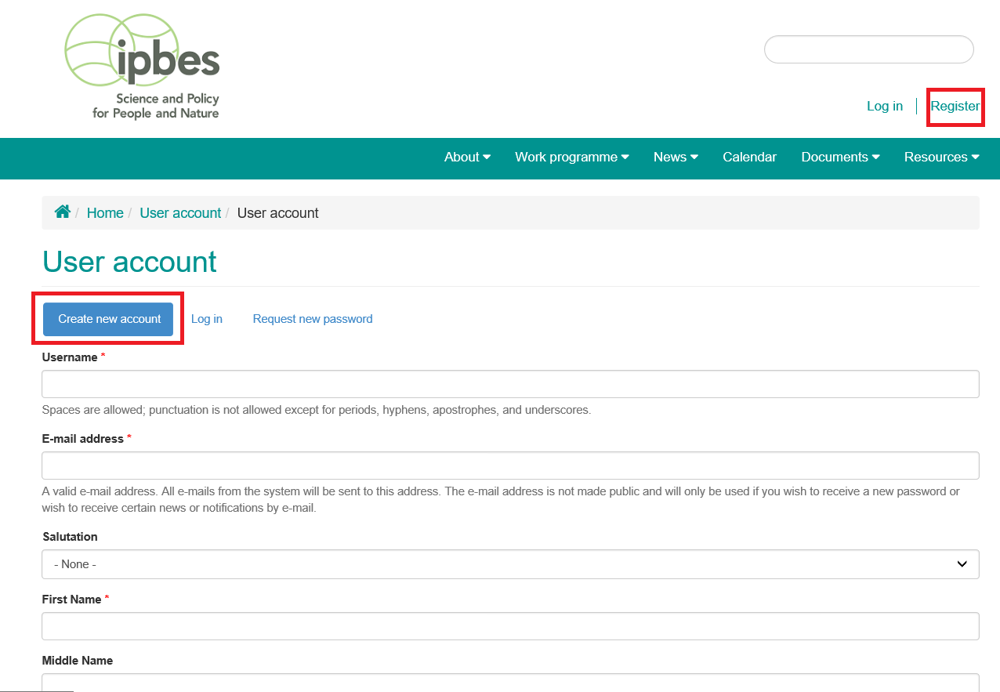
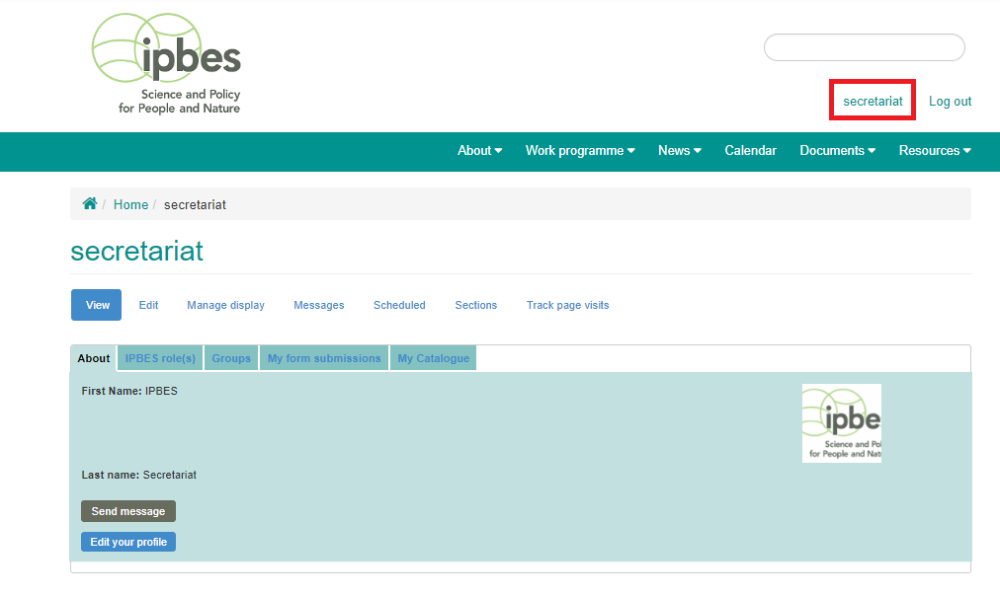

Account access and setup
------------------------
An account can be created by visiting https://www.ipbes.net/user/register and entering required information. The following information is requested at the time of registration: username, e-mail address, salutation, first name, middle name, last name, job title, affiliation, about,mailing list subscription, and security question.  Once accounts are created, users can login to provide additional information. Account verification can take up to 48 hours.

All registered users have a user dashboard which can be accessed after logging in by clicking on your username at the top right or by typing /user at the end of the site's URL i.e.  https://www.ipbes.net/user. Once you've accessed the login page, you can log in with your account information. We suggest bookmarking the page for quick access. The user dashboard will contain the name, photo and biography of the user. It will also contain all the IPBES roles assigned to the user, groups, form submissions and Policy Support content created by the user. 

