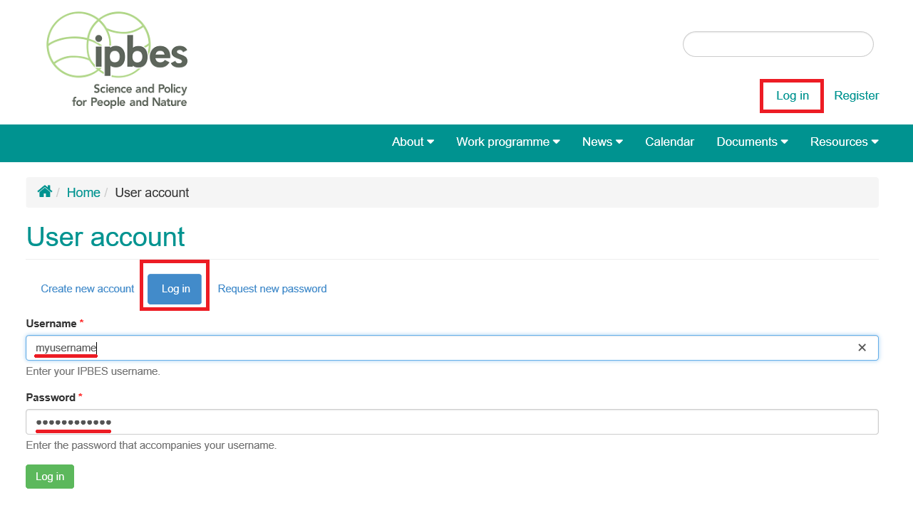
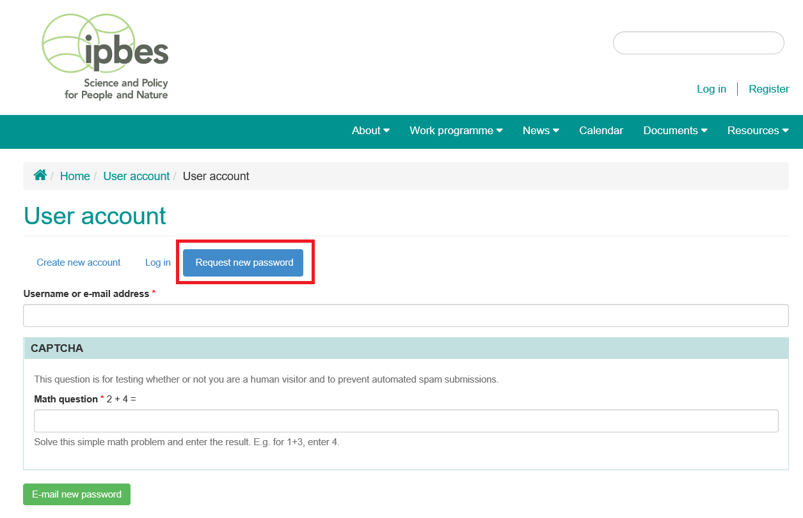

Getting your login information
~~~~~~~~~~~~~~~~~~~~~~~~~~~~~~

For your account details, you may receive an automated email with a link and further instructions for login or simply be contacted directly by the person managing your site. Once you receive your account information, you can access the site, log in, and begin setting up your profile.

Access the site and log in/log out

Get to the IPBES site and log in by either:

- Finding your IPBES site and typing /user in the web address bar after the site name.
- Following the link sent to you with your login information.
 
If you don't remember or can't find your password you can get a new password by clicking the Request new password button.

Use the login information provided to access the site and your profile. You'll see your most recent content, your profile details, and your profile image.

.. image:: ../images/account_profile.PNG
   :alt: Profile page for a user named "secretariat" displaying their login information and list of uploaded content.

When you're done adding and editing content on the site, you'll want to make sure you log out to avoid security risks. You can log out from anywhere on the site by using either of the buttons shown in the picture below.

Once you log out, you'll be taken back to the Home page of the site.
