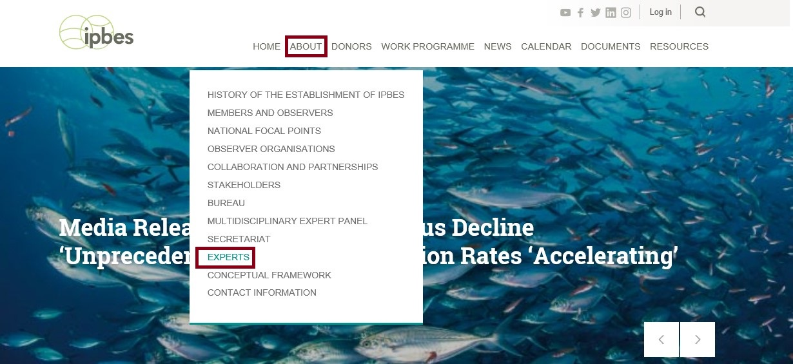
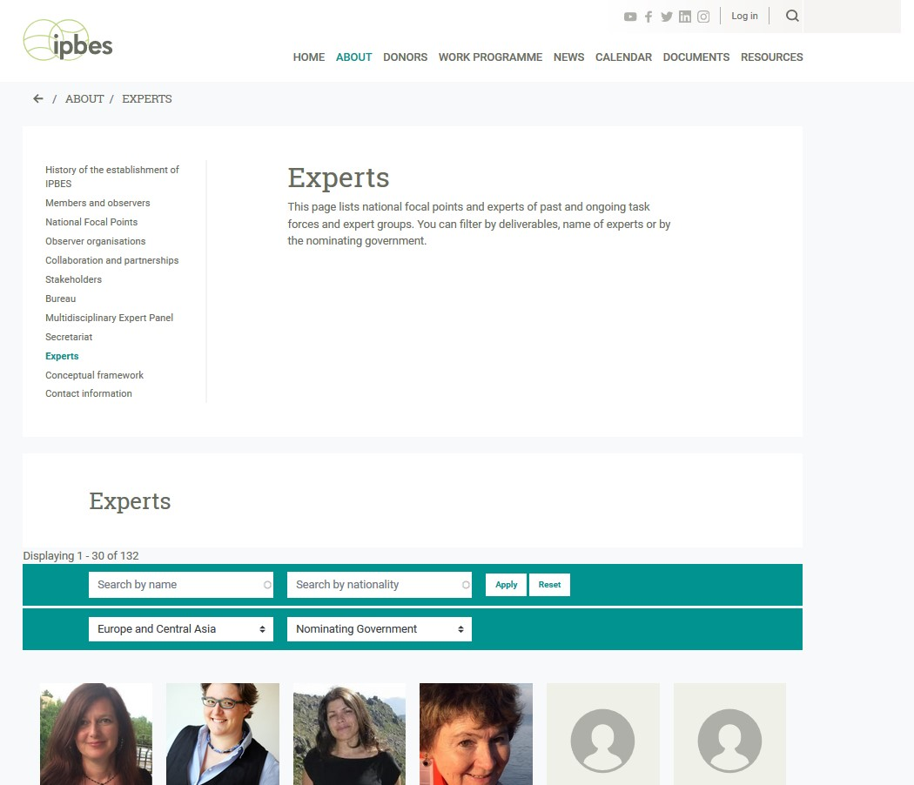

# Search

Search using keywords that will retrieve results containing one or more of the keywords you enter into the Search field. The results will be sorted by relevance, i.e. results corresponding to all search terms first then in decreasing relevance. For example, a search using the keywords “capacity building, knowledge and assessment” first will retrieve results containing all three words, then will retrieve results containing two of them, and finally will retrieve results containing all results with just one of the keywords.

* Widen search: add OR to your keyword searches to ensure that you retrieve all possible results around one topic
* Spelling: In order to increase your chances of finding the correct results, try using different spellings. For example, when looking for St Mark’s Venice, also try searching SAN MARCO.

  Key words: Try using fewer keywords in your searches; the fewer keywords used, the broader the selection of results.

  Boolean search: Boolean Search

* Using a star \(_\) or ‘wildcard’ word prefix will help you find words with the same beginning and multiple endings. For instance, Kand_ will bring up images of Kandinsky whether they are written with a y or an i.
* Bound search: Using quotations around specific phrasing, i.e. “Tiger, Tiger Burning Bright” or “dejeuner sur l’herbe” or “word play,” will narrow down your results to that specific wording.

## Expert search

The expert search page is available on [https://ipbes.net/experts](https://ipbes.net/experts)

## Documents search

* [Documents search](https://ipbes.net/document-library-categories)

